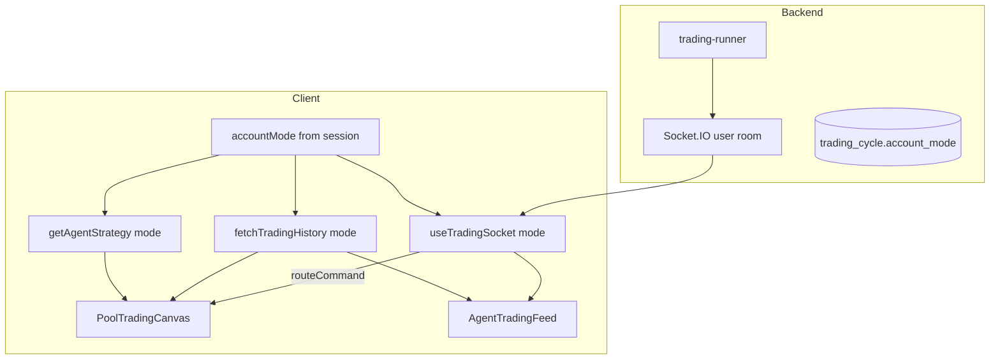

# Arcane — Agent Canvas & Real-Time Trading UI TODO

> **Goal:** The **View agents** canvas (`/dashboard/agents`) shows pool nodes, the orange agent moving pool→pool, and draggable trade/allocation panels — **correctly separated for demo (Anvil fork) and live (mainnet)** with real-time updates.

**References:**
- Canvas page: `client/app/(authenticated)/dashboard/agents/page.tsx`
- 3D scene: `client/components/pool-trading-canvas.tsx`
- Socket hook: `client/hooks/use-trading-socket.ts`
- Socket server: `backend/src/websocket/socket-server.ts`, `backend/src/websocket/trading-events.ts`
- Demo/live strategy (per mode): `agent_strategy.account_mode` — see recent migration

**Transport today:** Socket.IO (`/socket.io`) for push events; REST for history/status; 30s polling on dashboard as backup. **No webhooks.**

---

## Product decisions (locked)

| Decision | Choice |
|----------|--------|
| Real-time transport | **Socket.IO** (WebSocket + polling fallback) — keep, extend payloads |
| Demo vs live data | **Never mix** — filter by `accountMode` on client and tag on server |
| Strategy per mode | Separate `agent_strategy` rows (`demo` \| `live`) — **done** |
| Canvas layout | Same four panels; labels/copy/tx links change by mode |
| Tx display | Demo = fork hash (no explorer); live = Somnia explorer (`TxHashDisplay`) |
| Marketing fake feed | `use-trade-events.ts` stays **landing only** — not agent canvas |

---

## Architecture (target)

**Socket events (server → client):**
- `trading:cycle_started`
- `trading:action_executed` ← drives pool→pool animation + feed line
- `trading:cycle_completed`

---

## Phase A — Mode-safe real-time feed (backend + hook)

### A.1 Tag socket payloads with `accountMode`
- [x] Add `accountMode: "demo" | "live"` to `TradingCycleStartedEvent`, `TradingActionExecutedEvent`, `TradingCycleCompletedEvent` in `backend/src/websocket/trading-events.types.ts`
- [x] Mirror types in `client/lib/api/trading-socket-types.ts`
- [x] Pass `accountMode` from `trading-runner.service.ts` when calling `emitTradingCycleStarted` / `emitTradingCycleCompleted`
- [x] Pass `accountMode` in `emitFromToolOutcome`, `emitFromExecutedTransactions`, and direct `emitTradingActionExecuted` calls

### A.2 Filter events in the client hook
- [x] Extend `useTradingSocket({ accountMode, enabled, ... })` — ignore events where `event.accountMode !== accountMode`
- [x] Clear `feedItems` + `routeCommand` when `accountMode` changes (reconnect or reset state)
- [x] Wire `accountMode` from `useSession()` on agents page and dashboard

### A.3 Tests
- [x] Unit: event filter drops wrong-mode payloads (`backend/tests/unit/trading-socket-mode.test.ts`)
- [ ] Manual: run demo cycle → live tab shows nothing; switch to demo → see events

---

## Phase B — Hydrate canvas on load (not only live socket)

### B.1 Seed feed from trading history
- [x] On agents page mount: `fetchTradingHistory(1, 20, accountMode)` via `buildFeedFromTradingHistory`
- [x] Map recent cycle actions → `LiveTradingFeedItem[]` (`client/lib/trading-feed-helpers.ts`)
- [x] Prepend live socket events before history; cap at ~50 items (`useTradingSocket`)

### B.2 Optional last-route animation
- [x] From most recent swap/rebalance in history, set initial `routeCommand` with `replay: false` (agent rests at pool)
- [x] Idle fallback: largest allocation pool when no history route (`idleRouteForPool`)

### B.3 Refresh after cycle
- [x] Dashboard: on `cycleCompleted` / `actionExecuted` → reload portfolio + trading status + balances

---

## Phase C — Agent canvas UI (demo vs live polish)

### C.1 Rename & mode-aware trade panel
- [ ] Rename `LiveTradingFeed` → `AgentTradingFeed` (or keep file, add `accountMode` prop)
- [ ] Header: “Demo agent activity” (amber) vs “Live agent activity” (green)
- [ ] Use `TxHashDisplay` with `accountMode` instead of always `somniaTxUrl`
- [ ] Connection pill: `fork` vs `live` (agents page partially done)

### C.2 Scene hints & legend
- [ ] `PoolTradingCanvas` bottom hint: mode-specific copy (fork vs mainnet)
- [ ] `PoolNodesLegend`: “animates on swap events” → mode-aware one-liner
- [ ] Demo: subtle amber border or badge on canvas chrome (optional)

### C.3 Per-mode panel layout
- [ ] Change `use-panel-layout.ts` storage key: `arcane-agents-panel-layout:demo` \| `:live`
- [ ] Migrate or reset layout when switching mode first time

### C.4 Draggable panels (unchanged structure)
| Panel | Demo | Live |
|-------|------|------|
| Pool nodes | Fork pool legend | Mainnet pool legend |
| Trades | Demo Trades | Live Trades |
| Pool allocation | From demo strategy | From live strategy |
| Visualization | Fork WebSocket copy | Mainnet WebSocket copy |

---

## Phase D — Dashboard & navigation integration

### D.1 Agents tab → canvas
- [ ] “View demo agents” / “View live agents” already links to `/dashboard/agents` — verify session `accountMode` matches before navigation
- [ ] Optional: pass `?mode=demo` query as override for debugging (read in agents page)

### D.2 Account mode switch consistency
- [x] Dashboard `AccountModeSwitch` (demo \| live toggle)
- [x] Separate strategies per mode in DB
- [ ] Agents page: reload strategy + clear socket feed when mode changes (if user switches from dashboard sub-bar later)

### D.3 Update `ARCANE_DEMO_LIVE_TODO.md`
- [ ] Mark Phase 5.3 account switch as done (toggle + confirm live wallet)
- [ ] Remove “Separate demo strategy allocations” from out-of-scope (now implemented)

---

## Phase E — Canvas animation enhancements (optional v1.1)

- [ ] Pulse active pool nodes when `cycleActive`
- [ ] Red flash on target node when action `status === "failed"`
- [ ] Trail line between last N pool hops (reuse patterns from `agent-network-canvas.tsx`)
- [ ] Show multiple sub-agents as small satellites (future; v1 = one orange wallet agent)

---

## Phase F — QA checklist

### Demo
- [ ] Switch to **Demo** on dashboard → open **View demo agents**
- [ ] Pool nodes match **demo** strategy allocations
- [ ] Run demo cycle (`POST /agents/trading/run-cycle` or worker) → orange agent moves pool→pool
- [ ] **Demo Trades** panel fills; tx shows fork hash, no Somnia explorer link
- [ ] Switch to **Live** → demo events do not appear in feed

### Live
- [ ] Live strategy pools render as nodes
- [ ] Live cycle → agent animates; explorer links on mainnet txs
- [ ] Demo history does not appear in live feed

### Regression
- [ ] Socket auth still works (session cookie)
- [ ] Canvas works with zero pools (empty state message)
- [ ] Panel drag positions persist per mode

---

## Implementation order (do now)

1. **Phase A** — `accountMode` on socket events + hook filter *(unblocks correct demo/live separation)*
2. **Phase B** — history hydration *(canvas feels alive on page load)*
3. **Phase C** — `AgentTradingFeed` + `TxHashDisplay` + per-mode layout keys
4. **Phase D** — doc sync + navigation polish
5. **Phase E** — animation polish if time
6. **Phase F** — manual QA

---

## Key files

| Area | Files |
|------|--------|
| Socket types | `backend/src/websocket/trading-events.types.ts`, `client/lib/api/trading-socket-types.ts` |
| Emitters | `backend/src/websocket/trading-events.ts`, `backend/src/services/agents/trading-runner.service.ts` |
| Client hook | `client/hooks/use-trading-socket.ts` |
| Feed UI | `client/components/live-trading-feed.tsx` → `agent-trading-feed.tsx` |
| Tx links | `client/components/trading/tx-hash-display.tsx` |
| Canvas | `client/components/pool-trading-canvas.tsx`, `client/app/(authenticated)/dashboard/agents/page.tsx` |
| Layout | `client/hooks/use-panel-layout.ts` |
| History | `client/lib/api/trading.ts`, `client/lib/trading-helpers.ts` |

---

## Out of scope (this sprint)

- Replacing Socket.IO with raw WebSockets or SSE
- Inbound webhooks to the browser
- Per-user isolated Anvil instances
- Sub-agent avatars on the 3D canvas (v1.1+)
