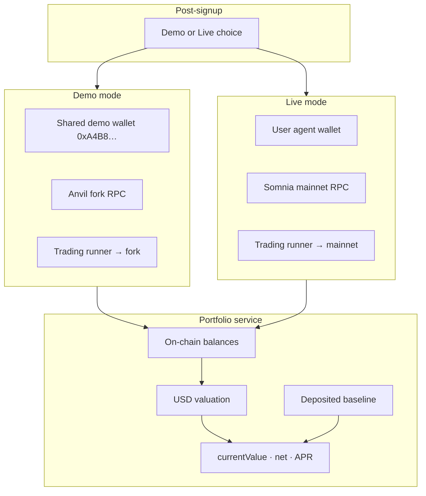

# Arcane — Demo vs Live Accounts TODO

> **Goal:** Every user chooses **Demo** or **Live** at signup. Demo uses one shared paper-trading wallet on an Anvil fork; Live uses the user’s custodial agent wallet on Somnia mainnet. All dashboard metrics (current value, deposited, net earned, APR) are **computed from real data** — no hardcoded multipliers.

**References:**
- Demo agent wallet (shared): `0xA4B8fEC2837AE227Fd64f344ef663c5a0bA4e46e`
- Fork whale (Anvil impersonation / seed): `0xd1f1f7b4354bd07e2035d95c12e3192017928054`
- Existing fork tooling: `backend/src/services/dev/anvil-fork.service.ts`, `npm run smoke:trading:cycle -- --fork`

---

## Product decisions (locked)

| Decision | Choice |
|----------|--------|
| Demo access | All signed-up users |
| Demo wallet | Single shared address for every demo user |
| Live wallet | Per-user custodial `user.walletAddress` (unchanged) |
| Deposited baseline | Manual `depositAmount` **and** auto-detect from wallet snapshot |
| Pricing | Pool-derived prices first (`priceLabel`, sqrt ratios, USDCe = $1); CoinGecko fallback |
| Demo trading | Full trading cycle on Anvil (same tools as live, fork RPC) |
| APR windows | **Since strategy activation** + **last 24h** (both shown) |
| Fake dashboard math | Remove `deposit × 1.0006`, fixed `16.43%` APR |

---

## Architecture overview

---

## Phase 0 — Config & data model

### 0.1 Environment & constants
- [x] Add `DEMO_AGENT_WALLET` (default `0xA4B8fEC2837AE227Fd64f344ef663c5a0bA4e46e`)
- [x] Add `DEMO_FORK_WHALE` (default `0xd1f1f7b4354bd07e2035d95c12e3192017928054`)
- [x] Add `ANVIL_RPC_URL` / document `QUICKSWAP_RPC_HTTP` override for demo paths
- [x] Add `DEMO_TRADING_ENABLED` flag (backend refuses demo cycles if Anvil unhealthy)
- [x] Update `backend/.env.example` and `backend/README.md`

### 0.2 Database — account mode per user
- [x] Add `account_mode` enum: `demo` | `live` on `User` (or `AgentStrategy` if mode is strategy-scoped)
- [x] Prisma migration + regenerate client
- [x] Default existing users → `live` (or prompt once on next login)

### 0.3 Portfolio snapshots (for APR & auto-deposit detect)
- [x] New table `portfolio_snapshot`:
  - `user_id`, `account_mode`, `wallet_address`, `total_value_usd`, `balances_json`, `captured_at`
- [x] New table `deposit_baseline` (or fields on `AgentStrategy`):
  - `manual_deposit_usd`, `detected_deposit_usd`, `baseline_usd`, `baseline_set_at`
- [x] Index on `(user_id, captured_at)` for 24h APR queries

---

## Phase 1 — Portfolio valuation service (backend)

### 1.1 USD price resolver
- [x] `portfolio/price.service.ts` — resolve USD per token:
  1. USDCe / USDT → `1.0`
  2. Pool `priceLabel` / `token1PerToken0` via active pools
  3. CoinGecko fallback (WSOMI, WETH, SOMI) — cache 60s
- [x] Unit tests for price precedence

### 1.2 Wallet net worth
- [x] `portfolio/valuation.service.ts`:
  - Input: `walletAddress`, `poolIds`, `rpcMode: 'mainnet' | 'fork'`
  - Output: `{ totalValueUsd, positions: [{ symbol, amount, valueUsd }] }`
- [x] Reuse `getWalletBalances()`; switch RPC via existing QuickSwap client reset pattern

### 1.3 Deposited baseline
- [x] `portfolio/baseline.service.ts`:
  - `manualDepositUsd` from `strategy.depositAmount`
  - `detectedDepositUsd` = first snapshot `total_value_usd` after activation (or max of detected inbound)
  - `baselineUsd` = `max(manual, detected)` or user-configurable rule (document: use **higher of manual vs first snapshot**)
- [x] Hook: on strategy `status → active`, capture initial snapshot

### 1.4 P&L & APR
- [x] `portfolio/metrics.service.ts`:
  - `currentValueUsd` = latest valuation
  - `netEarnedUsd` = `currentValueUsd - baselineUsd`
  - `aprSinceActivation` = annualized from `(net / baseline) / daysSince(tradingEnabledAt)`
  - `apr24h` = `(valueNow - value24hAgo) / value24hAgo × 365` (cap sane bounds)
- [x] Cron / post-cycle job: append `portfolio_snapshot` after each trading cycle

### 1.5 API
- [x] `GET /api/v1/portfolio/summary?mode=demo|live` (default user’s `account_mode`)
  - Returns: `currentValueUsd`, `baselineUsd`, `manualDepositUsd`, `detectedDepositUsd`, `netEarnedUsd`, `aprSinceActivation`, `apr24h`, `walletAddress`, `accountMode`, `chainLabel`
- [x] Extend `GET /api/v1/wallets/balances` with `?mode=demo|live` (resolve wallet + RPC)

---

## Phase 2 — Demo trading path (backend)

### 2.1 Demo wallet resolution
- [x] `resolveTradingWallet(user, mode)` → demo: `DEMO_AGENT_WALLET`, live: `user.walletAddress`
- [x] `resolveTradingRpc(mode)` → demo: Anvil, live: mainnet
- [x] Health check: demo cycles call `assertAnvilForkHealthy()` before run

### 2.2 Trading runner integration
- [ ] `trading-runner.service.ts`: read `user.accountMode` (not only smoke-script `--fork`)
- [ ] Demo path: `applyQuickSwapForkRpc()`, optional `fundAgentViaWhaleImpersonation(DEMO_FORK_WHALE)`, skip Somnia attestation
- [ ] Live path: unchanged mainnet + optional Somnia
- [ ] Persist `account_mode` on `TradingCycle` rows for history filtering

### 2.3 Demo cycle API
- [ ] `POST /api/v1/trading/cycles` respects account mode (or `?mode=demo` for explicit dev)
- [ ] Worker / scheduler: demo users can trigger cycles only when `DEMO_TRADING_ENABLED` and Anvil up
- [ ] Rate limit demo cycles (shared wallet — one cycle at a time globally?)

### 2.4 Shared-wallet concurrency
- [ ] Mutex / queue for demo wallet trades (all demo users share one key)
- [ ] UI message: “Demo trades run on a shared simulation wallet”

---

## Phase 3 — Signup & onboarding (client)

### 3.1 Account mode selection (new step after signup)
- [ ] New page: `/onboarding/account-mode` (before or after strategy type)
- [ ] **Demo card:**
  - Shared address `0xA4B8…` (read-only copy)
  - Explains: pre-funded paper portfolio on Anvil, no real money, same agent behavior
  - Shows approximate seeded balances (from env or API `GET /api/v1/demo/preview`)
- [ ] **Live card:**
  - User’s own agent wallet (from `GET /api/v1/auth/me` after signup)
  - Explains: deposit real tokens to this address on Somnia mainnet
- [ ] `PATCH /api/v1/users/account-mode` or include in first strategy upsert

### 3.2 Routing
- [ ] Update `resolve-post-auth.ts`:
  - No `account_mode` → `/onboarding/account-mode`
  - Then existing strategy onboarding flow
- [ ] Persist mode in session/context (`AccountModeProvider` or extend `session-provider`)

### 3.3 Setup / deposit UI
- [ ] Demo setup: hide “enter deposit USD” **or** pre-fill from detected demo balance; label “Simulation deposit (read-only)”
- [ ] Live setup: keep manual deposit + show live wallet balances for auto-detect hint
- [ ] `DepositAddressCard`: accept `mode` prop — show correct address & chain label

---

## Phase 4 — Dashboard (client)

### 4.1 Demo / Live toggle
- [ ] Header toggle on dashboard (switch view; live users can **view** demo metrics but not vice versa? → **view own mode only**, optional “Preview demo” link)
- [ ] Badge: `DEMO` orange / `LIVE` green in `PageSubBar`

### 4.2 Replace fake metrics
- [ ] Remove hardcoded `1.0006` / `16.43` in `dashboard/page.tsx`
- [ ] Fetch `GET /api/v1/portfolio/summary` on load + after trading socket cycle complete
- [ ] Display:
  - **Current value** — `currentValueUsd`
  - **Total deposited** — `baselineUsd` (with tooltip: manual vs detected)
  - **Net earned** — `netEarnedUsd` (red if negative)
  - **APR** — show both `aprSinceActivation` and `apr24h` (e.g. “16.2% (24h: 0.4%)”)

### 4.3 Balances & markets tabs
- [ ] `useWalletBalances(activePoolIds, mode)` → passes mode to API
- [ ] Markets table APY: keep pool `feeApr`; add note “Pool APY ≠ your portfolio APR”
- [ ] Agent wallet section label: “Demo wallet (simulation)” vs “Your agent wallet (mainnet)”

### 4.4 Trading status
- [ ] `fetchTradingStatus` includes `accountMode` on last cycle
- [ ] Explorer links: demo txs → local/fork note or omit; live → Somnia explorer

---

## Phase 5 — Auth & user API (backend + client)

### 5.1 Registration flow
- [ ] Signup still creates per-user live wallet (always) — demo mode does not skip wallet creation
- [ ] Return `accountMode: null` on register until onboarding step completes

### 5.2 User profile
- [ ] `GET /api/v1/auth/me` includes `accountMode`, `demoWalletAddress` (constant), `liveWalletAddress`
- [ ] `PATCH /api/v1/users/account-mode` — set once or allow switch with warning (live → demo OK; demo → live requires deposit?)

### 5.3 Account mode switch (optional v1)
- [ ] If allowed: switching live → demo is instant; demo → live requires confirming own wallet address

---

## Phase 6 — Testing & smoke

### 6.1 Backend tests
- [ ] Valuation service: mock balances + prices → `currentValueUsd`
- [ ] APR: snapshot series → `apr24h` / since activation
- [ ] Demo runner: mock Anvil, assert `DEMO_AGENT_WALLET` used

### 6.2 Integration
- [ ] `smoke:trading:cycle --fork` uses `DEMO_AGENT_WALLET` + `DEMO_FORK_WHALE` from env
- [ ] New `smoke:portfolio:summary` — fork fund → valuation → metrics

### 6.3 Manual QA checklist
- [ ] Signup → choose Demo → see shared address → dashboard shows fork balances
- [ ] Signup → choose Live → see own address → deposit → dashboard updates from mainnet
- [ ] Run demo trading cycle → metrics update without hardcoded values
- [ ] Run live cycle (staging) → metrics from mainnet wallet

---

## Phase 7 — Docs & ops

- [x] `backend/README.md`: demo vs live, Anvil setup, env vars
- [ ] `ARCANE_QUICKSWAP_TRADING_TODO.md`: cross-link demo/live section
- [ ] Runbook: `npm run fork:anvil` + `fork:reset` for local demo

---

## Implementation order (recommended)

1. ~~**Phase 0** — schema + env (foundation)~~ ✅
2. ~~**Phase 1** — portfolio service + API (unblocks dashboard)~~ ✅
3. **Phase 3.1–3.2** — account mode onboarding (signup prompt)
4. **Phase 4** — dashboard wired to real metrics
5. **Phase 2** — demo trading in product (not only smoke script)
6. **Phase 5** — profile / mode switch polish
7. **Phase 6–7** — tests & docs

---

## Out of scope (v1)

- Per-user isolated Anvil state (all demo users share one fork)
- Withdrawals / transfers from demo wallet
- Historical equity curve chart (snapshots stored for future)
- Separate demo strategy allocations (same strategy, different execution rail)

---

## Key files to touch (preview)

| Area | Files |
|------|--------|
| Schema | `backend/prisma/schema.prisma` |
| Config | `backend/src/config/env.ts`, `.env.example` |
| Portfolio | `backend/src/services/portfolio/*` (new) |
| Trading | `backend/src/services/agents/trading-runner.service.ts`, `dual-llm-trading.service.ts` |
| Fork | `backend/src/services/dev/anvil-fork.service.ts` |
| API | `backend/src/api/routes/v1/portfolio/*`, `wallets/balances.ts`, `users/account-mode.ts` |
| Onboarding | `client/app/onboarding/account-mode/page.tsx` (new) |
| Dashboard | `client/app/(authenticated)/dashboard/page.tsx` |
| Routing | `client/lib/routing/resolve-post-auth.ts` |
| API client | `client/lib/api/portfolio.ts` (new) |
