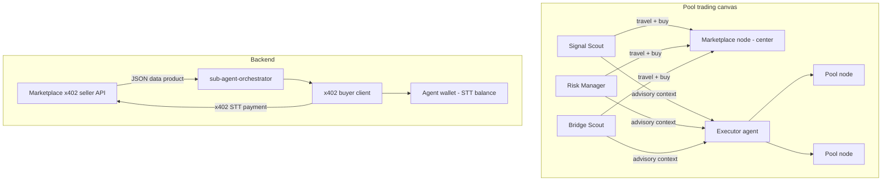

# Arcane — Marketplace Agent & x402 Data Economy TODO

> **Goal:** Add a **central Marketplace node** on the agent canvas. Sub-agents connect to it, **buy data via x402**, and use that intelligence in trading cycles. Payment uses **Somnia native testnet token (STT)** — **not USDC or USDT**.

**References:**
- Landing canvas (Marketplace visual prototype): `client/components/agent-network-canvas.tsx`, `client/lib/network-nodes.ts`
- Live trading canvas: `client/components/pool-trading-canvas.tsx`, `client/app/(authenticated)/dashboard/agents/page.tsx`
- Sub-agent orchestration: `backend/src/services/agents/sub-agent-orchestrator.ts`
- x402 docs (adapt for STT): `backend/api-ref.md` §4, [x402.org](https://x402.org)
- Somnia testnet: chain `50312`, RPC `https://api.infra.testnet.somnia.network`, native token **STT** (gas + micropayments)
- Related future item: `ARCANE_QUICKSWAP_TRADING_TODO.md` — x402 signal emission

**Status legend:** `[ ]` not started · `[x]` done

---

## Product decisions (locked)

| Decision | Choice |
|----------|--------|
| Marketplace role | **Centralized data seller** — shared hub any user's sub-agents can query |
| Sub-agent role | **Buyers** — read-only advisors that purchase enriched data before analysis |
| Executor role | Unchanged — only root agent executes `quoteSwap` / `swapExactIn` / `rebalanceToPool` |
| Payment rail | **x402** (HTTP 402 → sign → retry) |
| Payment asset | **Somnia native testnet token (STT)** — no USDC, no USDT |
| Network | Somnia testnet (`50312`) for x402 settlement; demo fork unchanged for paper trading |
| Canvas | Marketplace = fixed central node; sub-agents travel to it on purchase, return to pool ring |

---

## Architecture (target)

**Data products (v1):**
- Pool snapshot bundle (liquidity, APR, price, drift context)
- Spread / rebalance opportunity signal
- Cross-chain yield differential (Bridge Scout — advisory only until LI.FI ships)

---

## Phase 1 — Config & payment policy (STT, not stablecoins)

### 1.1 Environment & token config
- [x] Add `MARKETPLACE_ENABLED`, `MARKETPLACE_SELLER_ADDRESS`, `X402_FACILITATOR_URL` to `backend/.env.example` and `backend/src/config/env.ts`
- [x] Document STT as the **only** x402 settlement asset (reject USDC/USDT paths in Marketplace config)
- [x] Add `MARKETPLACE_PRICE_STT_WEI` (or per-product price map) — prices in wei of native STT
- [x] Add `SUB_AGENT_X402_BUDGET_STT_WEI` per strategy — max STT spend per trading cycle
- [x] Expose Marketplace budget + spend summary on agent strategy API (read-only for UI)

### 1.2 Wallet & balance checks
- [x] Reuse agent custodial wallet (`wallet-executor.ts`) as x402 buyer signer on testnet
- [x] Pre-flight: ensure agent wallet has enough STT for gas + micropayment before sub-agent buy phase
- [x] Clear error when STT insufficient — link to [testnet faucet](https://testnet.somnia.network)

---

## Phase 2 — Marketplace seller API (backend)

### 2.1 x402 seller middleware (STT)
- [x] Create `backend/src/services/marketplace/` module
- [x] Install `@x402/express`, `@x402/core`, `@x402/evm` (if not already present)
- [x] Implement seller paywall with **native STT** pricing (not `$0.05 USDC` — use wei STT per endpoint)
- [x] Register routes under `/api/v1/marketplace/...` (versioned REST)
- [x] Response envelope: standard `success` / `data` / `meta` / `error` shape

### 2.2 Data product endpoints
- [x] `GET /api/v1/marketplace/pools/snapshot` — current QuickSwap pool metrics for user's selected pools
- [x] `GET /api/v1/marketplace/signals/spread` — latest spread / rebalance opportunity (derived from `trading-recommendations`)
- [x] `GET /api/v1/marketplace/signals/cross-chain` — Bridge Scout advisory payload (static/LLM-enriched until LI.FI)
- [ ] Each endpoint: x402-gated, returns JSON schema documented in OpenAPI / `api-ref.md`

### 2.3 Catalog & pricing
- [x] `GET /api/v1/marketplace/catalog` — list products, STT price (wei), description (ungated or lightly gated)
- [x] Persist purchase receipts in DB (buyer userId, productId, amountSttWei, txHash, correlationId, createdAt)

---

## Phase 3 — x402 buyer integration (sub-agents)

### 3.1 Buyer client
- [x] Create `backend/src/services/marketplace/x402-buyer.ts` — `wrapFetchWithPayment` + agent wallet signer
- [x] Budget enforcement: per-call cap + per-cycle cap in STT wei
- [x] Product whitelist: only allow configured catalog IDs per strategy

### 3.2 Orchestrator wiring
- [x] Extend `sub-agent-orchestrator.ts` — optional Marketplace fetch **before** LLM sub-agent call
- [x] Map sub-agent id → default product (e.g. `signal-scout` → spread signal, `bridge-scout` → cross-chain)
- [x] Inject purchased JSON into sub-agent prompt alongside existing portfolio context
- [x] Emit socket events: `trading:marketplace_purchase_started`, `trading:marketplace_purchase_completed` (include `amountSttWei`, `productId`)

### 3.3 Fallback behavior
- [x] If Marketplace disabled or purchase fails → sub-agent runs on free inline context only (current behavior)
- [x] Log purchase failures without blocking the trading cycle

---

## Phase 4 — Canvas visualization

### 4.1 Marketplace node
- [x] Add central **Marketplace** mesh to `pool-trading-canvas.tsx` (fixed position, e.g. `[0, 6, 0]` or between pool ring and executor)
- [x] Distinct color — align with `#00ff88` from `network-nodes.ts` / landing canvas
- [x] Label in canvas legend: "Marketplace — shared data hub (x402 · STT)"

### 4.2 Sub-agent travel animation
- [x] New trip phase: `to_marketplace` → `at_marketplace` → `to_pool` (mirror `agent-network-canvas.tsx` pattern)
- [x] Trigger travel when `marketplace_purchase_started` socket fires
- [x] Optional data pulse / beam from Marketplace to sub-agent on `marketplace_purchase_completed`

### 4.3 Feed & explorer
- [x] Show Marketplace purchases in `agent-trading-feed.tsx` (filter tab or badge: "Marketplace")
- [x] Show x402 purchases in agent explorer table (product, STT paid, status)

---

## Phase 5 — Client UI & setup

### 5.1 Strategy setup
- [x] Sub-agent editor: toggle "Use Marketplace data" per sub-agent (or global toggle on custom/auto setup)
- [x] Display STT budget input (read-only in demo; configurable in live when funded)
- [x] Setup copy: payments in **STT**, not stablecoins

### 5.2 Dashboard / canvas chrome
- [x] Marketplace link or badge on agent canvas nav when enabled
- [x] STT spend this cycle / remaining budget in execution panel or portfolio bar area

---

## Phase 6 — Persistence & history

- [ ] Prisma model: `MarketplacePurchase` (userId, cycleId, subAgentId, productId, amountSttWei, paymentTxHash, status, metadata JSONB)
- [ ] Include Marketplace purchases in trading cycle summary / `TradingAction` records (`type: marketplace_purchase`)
- [ ] Explorer + trading history detail panel: expandable x402 receipt (product, STT amount, raw response)

---

## Phase 7 — Testing & smoke

- [ ] Unit: STT wei price parsing, budget cap logic
- [ ] Integration: mock x402 402 → pay → 200 flow on testnet (or facilitator mock)
- [ ] Smoke script: `npm run smoke:marketplace:purchase` — one sub-agent buys pool snapshot with STT
- [ ] Manual QA: enable Marketplace → run cycle → see canvas travel + feed line + STT deduction

---

## Phase 8 — Documentation sync

- [ ] Update `backend/api-ref.md` — Marketplace section notes **STT only**, not USDC
- [ ] Update `SYNAPSE_ARCHITECTURE.md` / `ARCANE_PROJECT_PLAN.md` payment examples where they say USDC → clarify STT for Arcane implementation
- [ ] Mark `[x]` on `ARCANE_QUICKSWAP_TRADING_TODO.md` x402 signal item when Phase 2–3 are complete

---

## Implementation order (recommended)

1. **Phase 1** — STT config & wallet policy
2. **Phase 2** — Seller API + catalog
3. **Phase 3** — Buyer + orchestrator (functional, no canvas yet)
4. **Phase 6** — Persistence (so purchases survive reload)
5. **Phase 4** — Canvas node + travel animation
6. **Phase 5** — Setup UI & budgets
7. **Phase 7** — Tests & smoke
8. **Phase 8** — Docs

---

## Key files (planned)

| Area | Files |
|------|--------|
| Config | `backend/src/config/env.ts`, `backend/.env.example` |
| Seller | `backend/src/services/marketplace/seller.ts`, `backend/src/api/routes/v1/marketplace/` |
| Buyer | `backend/src/services/marketplace/x402-buyer.ts` |
| Orchestrator | `backend/src/services/agents/sub-agent-orchestrator.ts`, `trading-runner.service.ts` |
| Socket | `backend/src/websocket/trading-events.types.ts`, `client/lib/api/trading-socket-types.ts` |
| Canvas | `client/components/pool-trading-canvas.tsx` |
| Feed | `client/components/agent-trading-feed.tsx` |
| Explorer | `client/app/(authenticated)/dashboard/explorer/page.tsx` |
| DB | `backend/prisma/schema.prisma` (migration for `MarketplacePurchase`) |
| Reference canvas | `client/components/agent-network-canvas.tsx`, `client/lib/network-nodes.ts` |

---

## Out of scope (this track)

- USDC / USDT x402 settlement
- Sub-agents executing on-chain txs (remain read-only)
- LI.FI / Jumper cross-chain execution (Bridge Scout stays advisory; see `ARCANE_QUICKSWAP_TRADING_TODO.md` Phase 9)
- Peer-to-peer signal listing by user agents (v2 — v1 is centralized Arcane Marketplace only)
- Mainnet STT/SOMI production pricing (testnet first)

---

## Progress summary

| Phase | Status |
|-------|--------|
| 1 — Config & STT policy | `[x]` Complete |
| 2 — Seller API | `[ ]` Not started |
| 3 — Buyer + orchestrator | `[ ]` Not started |
| 4 — Canvas | `[x]` Complete |
| 5 — Client UI | `[x]` Complete |
| 6 — Persistence | `[ ]` Not started |
| 7 — Testing | `[ ]` Not started |
| 8 — Docs | `[ ]` Not started |

*Last updated: 2026-06-09 — initial TODO created; all items unchecked.*
