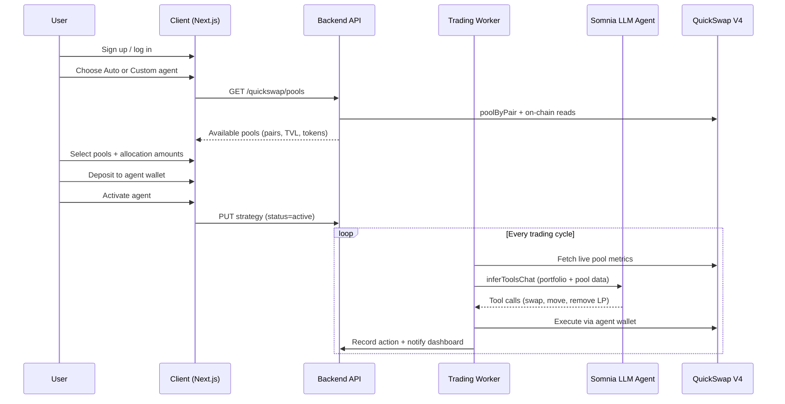

# Arcane — QuickSwap Pool Trading Implementation TODO

> **Product model:** User signs up → chooses Auto or Custom agent → selects **QuickSwap pools** (not generic protocols) → deposits funds → agent **autonomously moves capital between pools** using Somnia LLM Inference (`12847293847561029384`).  
> **No script-driven UX.** Scripts are dev-only smoke tests. All production flows start from the website and backend services.

**References:**
- [QuickSwap Contracts & Addresses](https://docs.quickswap.exchange/overview/contracts-and-addresses)
- [Somnia LLM Inference Agent](https://agents.somnia.network/agent/12847293847561029384)
- [Somnia LLM Inference Docs](https://docs.somnia.network/agents/base-agents/llm-inference)
- [Algebra Integral Swaps](https://docs.algebra.finance/algebra-integral-documentation/algebra-integral-technical-reference/guides/swaps/single-swaps)

---

## How it works (end-to-end)



---

## Phase 0 — Foundations & config

### 0.1 Documentation corrections
- [x] Update `backend/api-ref.md` QuickSwap section: V4 Algebra (not Uniswap V3), correct ABIs, remove broken `api.quickswap.exchange/v3/pools` URL
- [x] Update `SYNAPSE_ARCHITECTURE.md` §10.1: replace `fee: 3000` with `deployer: ZERO_ADDRESS`
- [x] Add QuickSwap + Somnia agent env vars to `backend/.env.example`

### 0.2 Chain & contract config
- [x] Create `backend/src/config/quickswap.ts` with per-network addresses:
  - AlgebraFactory, SwapRouter, QuoterV2, NonfungiblePositionManager
  - Somnia Mainnet (`5031`) — verified live
  - Somnia Testnet (`50312`) — stub until contracts deployed on RPC
- [x] Create known token registry (USDCe, WSOMI, WETH, USDT) with addresses + decimals
- [x] Add env: `QUICKSWAP_CHAIN_ID`, `QUICKSWAP_*` contract addresses, `QUICKSWAP_DEFAULT_SLIPPAGE_BPS`
- [x] Split chains: `getSomniaAgentEnv()` (testnet LLM) + `getQuickSwapEnv()` (mainnet pools)

### 0.3 Dependencies
- [x] Install `@cryptoalgebra/integral-periphery` (ABIs/interfaces)
- [x] Optionally install `@cryptoalgebra/integral-sdk` (route math helpers)
- [x] Keep `viem` as primary chain client (already installed)

---

## Phase 1 — Fetch available QuickSwap pools (backend)

> **User-facing goal:** On onboarding, show real QuickSwap pools the user can allocate capital to.

### 1.1 Pool discovery service
- [x] `backend/src/services/defi/quickswap/abis.ts` — SwapRouter, QuoterV2, Factory, Pool, NPM ABIs
- [x] `backend/src/services/defi/quickswap/constants.ts` — `ZERO_DEPLOYER`, default slippage, seed pairs
- [x] `backend/src/services/defi/quickswap/types.ts`:
  - `QuickSwapPool` — id, address, token0, token1, symbols, decimals
  - `PoolMetrics` — sqrtPrice, liquidity, feeApr (if available), lastUpdated
  - `PoolAllocation` — poolId, amount (replaces protocol allocation)
- [x] `backend/src/services/defi/quickswap/pool-registry.ts`:
  - `getPoolByPair(tokenA, tokenB)` via `AlgebraFactory.poolByPair`
  - `listKnownPools()` — seed pairs: USDCe/WSOMI, USDCe/WETH, WSOMI/WETH
  - `getPoolState(poolAddress)` — read slot0, liquidity, token balances
  - Filter out pools where address is `0x0`

### 1.2 Pool metrics & quoting
- [x] `backend/src/services/defi/quickswap/quote.service.ts`:
  - `quoteExactIn(tokenIn, tokenOut, amountIn)` via QuoterV2 (`deployer: ZERO`)
  - Handle viem uint160 decode edge case (raw `eth_call` fallback if needed)
- [x] `backend/src/services/defi/quickswap/pool-metrics.service.ts`:
  - Price of token1 per token0 from pool
  - Implied APR / volume (on-chain first; Ormi subgraph later)

### 1.3 REST API — pools (public / authenticated)
- [ ] `GET /api/v1/quickswap/pools` — list all available pools with token info + metrics
- [ ] `GET /api/v1/quickswap/pools/:poolId` — single pool detail + live quote samples
- [ ] `GET /api/v1/quickswap/pools/:poolId/quote?tokenIn=&amountIn=` — quote swap through pool
- [ ] Standard response envelope (`success`, `data`, `meta`, `error`)
- [ ] Register routes in `main.ts`

### 1.4 Client API client
- [ ] `client/lib/api/quickswap.ts` — `fetchPools()`, `fetchPoolQuote()`
- [ ] `client/lib/api/quickswap-types.ts` — mirror backend pool types

---

## Phase 2 — Onboarding: protocols → available pools (frontend + data model)

> **User-facing goal:** During Auto/Custom setup, user sees **QuickSwap pools** (e.g. USDCe/WSOMI) instead of generic protocols (Uniswap, Aave).

### 2.1 Database schema migration
- [ ] Replace `ProtocolId` enum (`uniswap`, `aave`, …) with pool-based allocation:
  - Option A: `PoolAllocation` table — `poolAddress`, `token0`, `token1`, `amount`
  - Option B: JSON column `poolAllocations` on `AgentStrategy` (faster MVP)
- [ ] Migration: `protocol_allocation` → `pool_allocation` (or new JSON field)
- [ ] Deprecate `ProtocolId` enum in Prisma
- [ ] Add `tradingEnabledAt`, `lastCycleAt` on `AgentStrategy`

### 2.2 Backend strategy types & service
- [ ] Update `strategy.types.ts`: `PoolAllocations = Record<poolId, number>`
- [ ] Update `strategy.service.ts` validation for pool IDs (must exist in registry)
- [ ] Update `strategy.repository.ts` read/write for pool allocations
- [ ] `PATCH /api/v1/agents/strategy/pool-allocations` (replaces `protocol-allocations`)

### 2.3 Frontend — pool selection UI
- [ ] Rename `ProtocolAllocationEditor` → `PoolAllocationEditor`
- [ ] Fetch pools from `GET /api/v1/quickswap/pools` on setup pages
- [ ] Show pool cards: pair name (USDCe/WSOMI), token icons, live price, optional APR
- [ ] Auto agent: pre-fill allocations across top pools by TVL/liquidity
- [ ] Custom agent: user picks which pools + allocation amounts (same UI, more control)
- [ ] Update `strategy-presets.ts`: remove Aave/Compound/Lido labels; use pool labels
- [ ] Update sub-agent prompts: "Executes rebalances across **QuickSwap pools**" (not Aave/Lido)

### 2.4 Setup flow pages
- [ ] `client/app/setup/auto/page.tsx` — use `PoolAllocationEditor` + live pools
- [ ] `client/app/setup/custom/page.tsx` — same pool picker, user toggles sub-agents
- [ ] `client/app/onboarding/strategy/page.tsx` — copy update: "pools" not "protocols"
- [ ] Deposit step unchanged: user sends funds to agent wallet address
- [ ] On activate: `status: "active"` triggers first trading cycle (see Phase 4)

---

## Phase 3 — QuickSwap execution layer (backend)

> **Goal:** Backend can swap and move liquidity between pools on behalf of the user's agent wallet.

### 3.1 Swap service
- [ ] `backend/src/services/defi/quickswap/swap.service.ts`:
  - `buildApprove(token, spender, amount)` — ERC20 approve calldata
  - `buildSwapExactIn(tokenIn, tokenOut, amountIn, slippageBps, recipient)` — `exactInputSingle`
  - `buildSwapRoute(path, amountIn, slippageBps, recipient)` — `exactInput` multihop
  - Path encoding: `token + deployer(0x0) + token + deployer(0x0) + token`
- [ ] `backend/src/services/defi/quickswap/quickswap.adapter.ts` — facade over quote + swap + pool

### 3.2 Route planner (pool-to-pool capital movement)
- [ ] `backend/src/services/defi/quickswap/route-planner.ts`:
  - Graph: tokens as nodes, pools as edges
  - Find paths between source pool token and target pool token (max 3 hops)
  - Quote all candidate paths; pick best `amountOut`
  - `planRebalance(fromPool, toPool, amount)` — returns executable route
- [ ] Use case: move USDCe from USDCe/WSOMI exposure → USDCe/WETH exposure via swap route

### 3.3 Liquidity provision (optional MVP+)
- [ ] `backend/src/services/defi/quickswap/liquidity.service.ts`:
  - `buildMintPosition(token0, token1, amounts, tickRange)` — NPM `mint`
  - `buildRemoveLiquidity(tokenId, percent)` — NPM `decreaseLiquidity`
  - `buildCollectFees(tokenId)` — NPM `collect`
- [ ] MVP decision: **swaps only first**; LP add/remove in Phase 3.3 if time allows

### 3.4 Agent wallet execution
- [ ] `backend/src/services/agents/wallet-executor.ts`:
  - Load user agent wallet from encrypted key (existing `email-wallet.service`)
  - Sign + submit swap txs via viem `walletClient`
  - Nonce management, gas estimation, receipt polling
- [ ] Safety guards:
  - Max swap size per cycle (% of portfolio)
  - Slippage cap (`QUICKSWAP_DEFAULT_SLIPPAGE_BPS`)
  - Allowed tokens whitelist (pools user selected only)
  - Refuse tx if agent wallet balance insufficient

---

## Phase 4 — Somnia LLM Inference orchestration (user-triggered, not scripts)

> **Agent ID:** `12847293847561029384` ([LLM Inference](https://agents.somnia.network/agent/12847293847561029384))  
> **Method:** `inferToolsChat` — LLM returns tool calls; backend executes them.

### 4.1 Somnia agent service (production, not smoke script)
- [ ] Extract platform ABI + caller from `scripts/smoke-llm-inference.ts` into:
  - `backend/src/services/somnia/platform.abi.ts`
  - `backend/src/services/somnia/agent-caller.ts`
- [ ] `createRequest(agentId, payload)` + poll `RequestFinalized` + decode result
- [ ] Env: `SOMNIA_AGENT_PLATFORM`, `SOMNIA_LLM_AGENT_ID`, `SOMNIA_LLM_PER_AGENT_COST_WEI`
- [ ] Scripts remain **dev-only** smoke tests; production uses `agent-caller.ts`

### 4.2 LLM tool definitions (onchain tools for inferToolsChat)
- [ ] `backend/src/services/somnia/quickswap-llm-tools.ts` — register tools the LLM can call:
  - `listPools()` — pools user allocated to + live metrics
  - `quoteSwap(tokenIn, tokenOut, amountIn)` — read-only quote
  - `swapExactIn(tokenIn, tokenOut, amountIn)` — move between pools
  - `rebalanceToPool(targetPoolId, amount)` — route planner + swap
  - `getPortfolio()` — agent wallet balances per pool token
- [ ] System prompt template per strategy type (auto vs custom)
- [ ] Auto: "Optimise yield across selected pools; rebalance when spread > X%"
- [ ] Custom: respect user sub-agent config + pool selection only

### 4.3 Trading runner service (core loop)
- [ ] `backend/src/services/agents/trading-runner.service.ts`:

```
runCycle(userId):
  1. Load active strategy + pool allocations + agent wallet
  2. Fetch live pool metrics (prices, liquidity, spreads)
  3. Build portfolio context JSON for LLM
  4. Call Somnia inferToolsChat (agent 12847293847561029384)
  5. While finishReason == "tool_calls":
       - Execute tool (quote = eth_call; swap = wallet tx)
       - Append result to conversation
       - Resume inferToolsChat
  6. Record all actions in DB
  7. Update strategy.lastCycleAt
  8. Return cycle summary to API / WebSocket
```

- [ ] Decision factors fed to LLM:
  - Current allocation vs target allocation per pool
  - Price spread between pool pairs
  - Time since last rebalance (`lastCycleAt`)
  - Agent wallet balances
  - Slippage estimate for proposed move
  - Risk limits from sub-agent config (max drawdown, max single move %)

### 4.4 Triggering trading (user side, not scripts)
- [ ] **On activate:** first cycle runs when user sets `status: "active"` after deposit
- [ ] **Scheduled worker:** `backend/src/workers/trading-cycle.worker.ts`
  - Poll active strategies every N minutes (configurable per auto/custom)
  - Auto: every 5–15 min; Custom: user-defined interval in strategy config
- [ ] **Manual trigger:** `POST /api/v1/agents/trading/run-cycle` (authenticated)
- [ ] **Deposit detection:** optional — watch agent wallet balance; start cycle when deposit confirmed

### 4.5 REST API — trading
- [ ] `POST /api/v1/agents/trading/run-cycle` — trigger one LLM + execution cycle
- [ ] `GET /api/v1/agents/trading/status` — last cycle time, pending request, agent state
- [ ] `GET /api/v1/agents/trading/history` — paginated list of swaps/rebalances
- [ ] `GET /api/v1/agents/trading/history/:id` — single action detail + tx hash

---

## Phase 5 — Persistence & activity tracking

### 5.1 Database models
- [ ] `TradingCycle` — userId, strategyId, somniaRequestId, startedAt, finishedAt, status, llmSummary
- [ ] `TradingAction` — cycleId, type (swap|rebalance|add_liquidity|remove_liquidity), tokenIn, tokenOut, amountIn, amountOut, poolFrom, poolTo, txHash, status
- [ ] `PoolSnapshot` — optional cache of pool metrics at cycle time (for audit / signals)

### 5.2 Repositories
- [ ] `trading.repository.ts` — CRUD for cycles + actions
- [ ] Link actions to user + strategy for dashboard history

---

## Phase 6 — Dashboard & user visibility (frontend)

> User sees agent working on their behalf after setup.

### 6.1 Dashboard widgets
- [ ] Active pools panel — pools agent is managing + current allocation %
- [ ] Last trade card — most recent swap/rebalance (pair, amount, time, tx link)
- [ ] Agent status — `idle` | `analyzing` | `executing` | `waiting_deposit`
- [ ] Pool metrics strip — live prices from selected pools

### 6.2 Trading history page
- [ ] `client/app/dashboard/trading/page.tsx` — list of cycles + actions
- [ ] Link to Somnia explorer for tx hashes
- [ ] Show LLM reasoning summary per cycle (from `TradingCycle.llmSummary`)

### 6.3 Real-time updates (later)
- [ ] WebSocket event: `trading:cycle_started`, `trading:action_executed`, `trading:cycle_completed`
- [ ] Push to dashboard particle visualiser (agent moves between pool nodes)

---

## Phase 7 — Safety, limits & strategy rules

### 7.1 Risk controls (backend enforced, not LLM-only)
- [ ] Max % of portfolio per single swap (e.g. 20%)
- [ ] Max slippage bps (default 50 = 0.5%)
- [ ] Cooldown between cycles (prevent over-trading)
- [ ] Only trade tokens/pools user selected at onboarding
- [ ] Pause trading if agent wallet balance < minimum
- [ ] Risk Manager sub-agent rules map to hard backend limits

### 7.2 Auto vs Custom behaviour
| | Auto Agent | Custom Agent |
|---|---|---|
| Pool selection | Top pools pre-selected by liquidity | User picks pools manually |
| Allocation | Auto-balanced by TVL | User sets amounts |
| Cycle interval | Fixed (e.g. 10 min) | User-configurable |
| Sub-agents | Full preset (orchestrator, yield, signal, risk) | User toggles + custom prompts |
| LLM prompt | Aggressive yield optimisation | Respect user constraints |

- [ ] Implement strategy-type-specific prompts in `trading-runner.service.ts`
- [ ] Store `cycleIntervalMinutes` on `AgentStrategy`

---

## Phase 8 — Testing & dev tooling

> Scripts are **not** the product path — only for CI / local verification.

- [ ] `scripts/smoke-quickswap-pools.ts` — list pools on mainnet
- [ ] `scripts/smoke-quickswap-quote.ts` — quote USDCe→WSOMI
- [ ] `scripts/smoke-trading-cycle.ts` — one full LLM cycle against test wallet (dev only)
- [ ] Integration test: `GET /quickswap/pools` returns ≥ 1 pool
- [ ] Integration test: active strategy → `run-cycle` → action recorded (mocked LLM optional)

---

## Phase 9 — Future (post-MVP)

- [ ] Ormi subgraph integration for historical volume/APR (replace on-chain-only metrics)
- [ ] LP add/remove in automated cycles (not just swaps)
- [ ] ERC-4337 smart account execution (Pimlico) instead of EOA
- [ ] Cross-chain bridge scout (LI.FI) when moving between Somnia and other chains
- [ ] x402 signal emission when agent detects pool spread opportunity
- [ ] 3D visualiser: pool nodes as anchors, agent particle moves between them

---

## File checklist (new / modified)

### Backend — new files
```
src/config/quickswap.ts
src/services/defi/quickswap/
  abis.ts, constants.ts, types.ts
  pool-registry.ts, pool-metrics.service.ts
  quote.service.ts, swap.service.ts
  route-planner.ts, liquidity.service.ts
  quickswap.adapter.ts, index.ts
src/services/somnia/
  platform.abi.ts, agent-caller.ts, quickswap-llm-tools.ts, types.ts
src/services/agents/
  trading-runner.service.ts, trading.repository.ts, wallet-executor.ts
src/api/routes/v1/quickswap/pools.ts
src/api/routes/v1/agents/trading.ts
src/workers/trading-cycle.worker.ts
prisma/migrations/xxx_pool_allocations.sql
```

### Backend — modify
```
src/main.ts                          # register new routes
src/config/env.ts                    # quickswap + somnia env
src/services/agents/strategy.types.ts
src/services/agents/strategy.service.ts
src/services/agents/strategy.repository.ts
src/api/routes/v1/agents/strategy.ts
backend/api-ref.md
backend/.env.example
prisma/schema.prisma
```

### Client — new files
```
lib/api/quickswap.ts
lib/api/quickswap-types.ts
lib/api/trading.ts
app/dashboard/trading/page.tsx
components/setup/pool-allocation-editor.tsx
components/dashboard/active-pools-panel.tsx
components/dashboard/last-trade-card.tsx
```

### Client — modify
```
lib/api/strategy-types.ts            # PoolAllocations
lib/strategy-presets.ts              # pool labels, prompts
app/setup/auto/page.tsx
app/setup/custom/page.tsx
app/onboarding/strategy/page.tsx
components/setup/protocol-allocation-editor.tsx  → deprecate / replace
```

---

## Implementation order (recommended)

```
1. Phase 0 + Phase 1     → Pools API working (backend can list QuickSwap pools)
2. Phase 2               → Onboarding shows pools instead of protocols
3. Phase 3.1–3.2         → Swap + route planner (execution without LLM)
4. Phase 4               → Somnia LLM cycle drives swaps
5. Phase 5 + 6           → History + dashboard visibility
6. Phase 7               → Risk limits hardening
7. Phase 3.3 + 9         → LP + advanced features
```

**First user-visible milestone:** User completes setup, selects USDCe/WSOMI + USDCe/WETH pools, deposits, activates → within one cycle the agent swaps on QuickSwap based on Somnia LLM inference.

---

## Open decisions (confirm before coding)

- [ ] **Network:** QuickSwap on mainnet (`5031`) for swaps; Somnia LLM on testnet — or unify when testnet QuickSwap is live?
- [ ] **MVP scope:** Swaps only, or swaps + LP in v1?
- [ ] **Cycle interval default:** 5 min, 10 min, or 15 min for auto agent?
- [ ] **Pool allocation schema:** separate `pool_allocation` table vs JSON column on strategy?

---

*Last updated: 2026-06-06*
